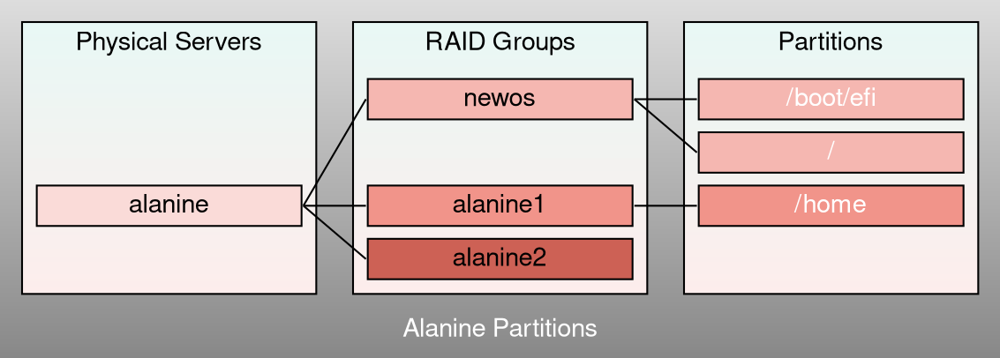

###### tags #documentation #sysadmin

## How-To

- [[Sysadmin/User Documentation/Conda@U1078]]
- [[Sysadmin/User Documentation/Mettre à disposition des fichiers via https]]

> [!INFO] **Paralleliser avec `xargs`**
> 
> The xargs command can be used to run the same script with differente arguments, in parallel
> - the -P*n* arguments allows xargs to use at most *n* processors at all time
> - the -l arguments tells to read each line as a list of arguments.
> 
> *Example*
> Considere a script script.sh . We want to launch that script 1000 times, using at most 8 processors.
> 
> We put the arguments of the script in a file arguments.lst, and execute :
> 
> `cat arguments.lst | xargs -l -P8 ./script.sh`

> [!WARNING] **Récupérer des fichiers effacés/corrompus**
> 
> 1. Trouver le fiesystem qui contient le fichier : `df .`
> 2. Aller dans le répertoire du filesystem (ex `cd /mnt/projects1/`)
> 3. Aller dans le répertoire caché zfs `cd .zfs/snashot`
> 4. Repérer une date de sauvegarde qui pourrait contenir une version acceptable du fichier (ex `cd zfs-auto-snap_monthly-2022-10-01-0452`)
> 5. Copier le fichier depuis ce répertoire vers le bon répertoire de travail

## Cours M2GGB

Des TP de bioinfo, des tutoriaux informatiques et des exercies sont disponibles en bas de cette page : [[Cours/M2GGB/TP M2GGB]]

Test :

